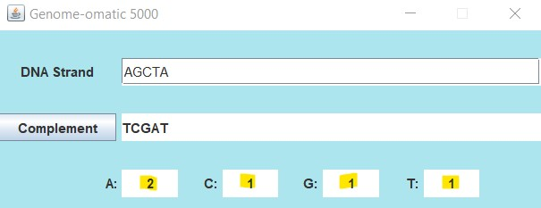

## Genome-ormatic

## Demo

## Description

This program creates a window with a field for entering text, and associated
EventButton object for responding to user actions. The program will
take input in DNA format and generate the DNA complement, along with a count
of each base occurring. Non-DNA input results in an error message.

## Language

-Java
